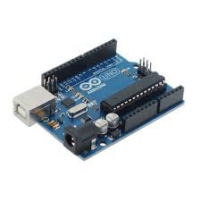
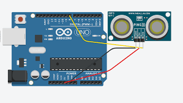
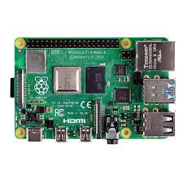
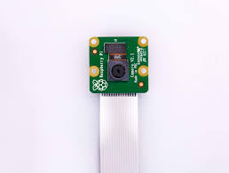

# Safety home automation

This directory contains informations and code to create a video surveillance, alarm and information system in case of home intrusion.

## Hardware

The hardware use to make this system is as follow :
- One Arduino (at least Uno),  

- Ultrasonic sensor to determine the distance,  

- Speaker,  

- One Raspberry Pi (at least 3 Model B) to manage the system,  
- One Raspberry Pi for each camera,  

- Raspberry Pi compatible cameras    


## Software

**Operating System**

Each Raspberry Pi must have Raspbian installed. You can choose an other OS but Raspbian is advisable.

### Arduino
This code is to manage all the sensors linked to the arduino (Distance sensor and alarm)
```sh
//Arduino code here
```
### Python
This code is to automatically send a message when a intruder is detected
```sh
$ pip install fbchat
```
```sh
# -*- coding: UTF-8 -*-

from fbchat import Client
from fbchat.models import *

client = Client("<email>", "<password>")

print("Own id: {}".format(client.uid))

client.send(Message(text="Hi me!"), thread_id=client.uid, thread_type=ThreadType.USER)

client.logout()
```

### HTML/CSS
This code is to monitor the room in live
```sh
//Arduino code here
```
 
