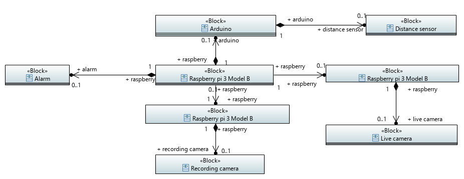
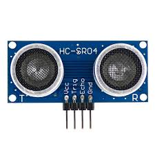

# Safety home automation

This directory contains informations and code to create a video surveillance, alarm and information system in case of home intrusion.

## How it's work
  
 
   
First of all, an Arduino will be placed behind the front door. 
An ultrasonic sensor that measures the distance will be connected to this Arduino.
When the door opens, the distance returned by the sensor will be shorter. 
If the distance is less than a certain limit (calibration) a message will be sent to the Raspberry via the serial port.
When the Raspberry receives the message it will emit a sound (alarm) on a speaker connected by jack.
He will then send an HTTP request for the second Raspberry wich controls the camera to ask him to activate it.
The second Raspberry will then start recording for a few minutes.
  
## Hardware

The hardware use to make this system is as follow :
- One Arduino (at least Uno),  
  

  
- Ultrasonic sensor to determine the distance, 
   

  
- Speaker,  
  

  
- One Raspberry Pi (at least 3 Model B) to manage the system,  
- One Raspberry Pi for each camera,  
  

  
- Raspberry Pi compatible cameras 
     


## Software

**Operating System**

Each Raspberry Pi must have Raspbian installed. You can choose an other OS but Raspbian is advisable.

### Python
This code is to automatically send a message when a intruder is detected
```sh
$ pip install fbchat
```
```sh
# -*- coding: UTF-8 -*-

from fbchat import Client
from fbchat.models import *

client = Client("<email>", "<password>")

print("Own id: {}".format(client.uid))

client.send(Message(text="Hi me!"), thread_id=client.uid, thread_type=ThreadType.USER)

client.logout()
```
### Apache
Update Raspbian
```sh
$ sudo apt update
$ sudo apt upgrade
$ sudo apt update
```
Install apache
```sh
$ sudo apt install apache2
```
Directory will be readable
```sh
$ sudo chown -R pi:www-data /var/www/html/
```
Directory will be readable, writable and executabl
```sh
$ sudo chmod -R 770 /var/www/html/
```
Get the home page
```sh
$ wget -O apache.html http://127.0.0.1
```
If it's done, you can see "it's work" on the code
```sh
$ cat ./apache.html
```
### PHP
Install PHP
```sh
$ sudo apt install php php-mbstring
```
Delete /var/www/index/index.html 
```sh
$ sudo rm /var/www/html/index.html
```
Create index.php with phpinfo()
```sh
$ echo "<?php phpinfo(); ?>" > /var/www/html/index.php
```
### Command
Record a video during 5s with size 640x480 in ./output.avi
```sh
$ ffmpeg -t 5 -f v4l2 -framerate 25 -video_size 640x480 -i /dev/video0 output.avi
```


 
